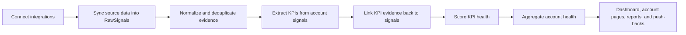
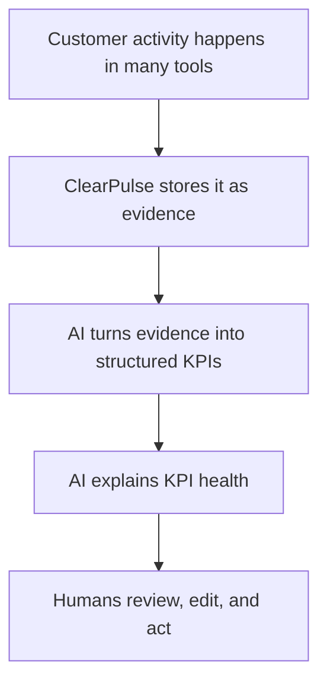

# ClearPulse Complete Platform Guide

This is the long-form guide for understanding ClearPulse end to end.

Use this document if you want to understand:

- what the platform is solving
- how the product works from a user point of view
- how data moves through the system
- how KPI extraction works
- how health scoring works
- what the main terms mean
- where the system is strong
- where the system is still heuristic or limited

If you want shorter, task-focused documentation, also see:

- [Platform Usage and Integrations](platform-usage-and-integrations.md)
- [Product Architecture and AI Flow](product-architecture-and-ai-flow.md)

## 1. What ClearPulse Is

ClearPulse is an AI-assisted customer intelligence platform for post-sale teams.

It is designed for a situation most Customer Success, Account Management, and leadership teams already know well:

- customer information lives in too many systems
- teams spend time manually stitching the account story together
- KPI health is often discussed from memory, not from evidence
- executive updates and QBR prep are repetitive and slow

ClearPulse solves that by doing three things:

1. collecting customer signals from different systems
2. turning those signals into structured KPI and health data
3. showing that information in one account and portfolio workspace

In plain language:

ClearPulse tries to answer:

- What is happening in this account?
- Which KPIs matter?
- Are those KPIs healthy or at risk?
- What evidence supports that conclusion?

## 2. Who The Product Is For

ClearPulse supports different kinds of users.

### Admins

Admins configure integrations, run syncs, manage users, and monitor platform behavior.

### Leadership

Leadership uses ClearPulse to understand portfolio-level health, see which accounts need attention, and review leadership-ready account summaries.

### CSMs / AMs

CSMs and account managers use ClearPulse to work directly on an account:

- reviewing signals
- checking meetings
- inspecting extracted KPIs
- updating account context
- generating reports

### Viewers

Viewers are read-only users who need visibility but should not change anything.

## 3. The Main Problem ClearPulse Solves

Without ClearPulse, the account story is usually spread across:

- Slack
- meeting transcripts
- CRM notes
- Jira
- Vitally
- docs
- shared folders
- account plans

That creates a common pattern:

1. a CSM prepares for a customer review
2. they pull notes from multiple places
3. they manually decide what the real KPIs are
4. they manually guess what is healthy or risky
5. leadership sees a summary, but not always the evidence behind it

ClearPulse reduces that manual synthesis by building an evidence layer first, then deriving KPIs and health from it.

## 4. The Most Important Concepts

To understand ClearPulse, it helps to understand the main objects in the system.

### Client Account

A `ClientAccount` is the account record you work from in the product.

It contains:

- account name
- domain
- tier
- industry
- health score
- health status
- current state / goals / plan text
- related KPIs
- related signals
- related meetings
- related contacts

This is the main anchor point for everything else.

### Raw Signal

A `RawSignal` is a normalized piece of evidence.

Examples:

- a Slack message
- a Fathom meeting summary
- a Jira issue update
- a Vitally note
- a document excerpt

A signal is not yet a KPI. It is raw evidence that might support a KPI later.

Signals usually contain:

- source
- title
- content
- author
- URL
- signal date

#### Example: A normalized raw signal

Below is the kind of shape ClearPulse is effectively working with after sync:

```json
{
  "id": "cmngexample1",
  "source": "FATHOM",
  "title": "Quarterly Business Review",
  "author": "Dana Kim, Alex Boyd",
  "signalDate": "2026-04-03T14:00:00.000Z",
  "content": "## AI Summary\nCustomer said onboarding is moving well, but SSO routing is still manual.\n\n## Transcript\n[00:07:46 Dana Kim] We still need auto-routing through SSO groups before the rollout is complete.",
  "url": "https://fathom.ai/recording/123"
}
```

This is not yet a KPI.

It is just one structured piece of evidence that may later support one or more KPIs.

### KPI

A `ClientKPI` is a structured measurable item derived from account evidence.

Examples:

- Tier 1 ticket deflection rate
- onboarding completion %
- adoption of analytics dashboard
- response time SLA
- renewal risk signal

A KPI is the product’s structured interpretation of the account’s measurable success criteria.

#### Example: What a KPI looks like after extraction

```json
{
  "metricName": "SSO-based content routing adoption",
  "targetValue": "100%",
  "currentValue": "Manual dropdown routing",
  "unit": null,
  "category": "ADOPTION"
}
```

That KPI is much more useful than the original meeting sentence because it is:

- named
- categorized
- measurable
- linked to evidence

### KPI Evidence

`KPIEvidence` is what connects a KPI back to the raw signals that support it.

This is one of the product’s most important trust mechanisms.

Instead of saying:

"The KPI looks risky because the AI said so"

ClearPulse can say:

"This KPI exists because these 3 signals support it"

### Meeting

A `Meeting` is a structured meeting record, mainly created from Fathom today.

It contains:

- title
- transcript
- summary
- meeting date
- participants
- recording URL

Meetings are important because they often contain the richest account context.

### Sync Job

A `SyncJob` records when a source sync was triggered, whether it completed, and if it failed.

This is how the admin can understand if the latest data is actually fresh.

## 5. End-To-End Product Flow

At the highest level, the platform works like this:



There are two big ideas here:

1. ClearPulse does not go directly from raw tools to final health scores.
2. The intermediate evidence layer matters a lot.

## 6. How Users Actually Use The Product

The normal workflow looks like this:

1. Admin connects integrations and AI providers.
2. Admin or CSM triggers a sync.
3. Signals appear on the account.
4. User reviews the signals if needed.
5. User runs KPI extraction.
6. ClearPulse creates or updates KPIs and evidence links.
7. User runs health scoring or lets it run automatically.
8. User reviews the account page, dashboard, and report.

So from a user perspective, the platform has four major stages:

- connect
- sync
- extract
- score

Everything else is visibility, control, or output.

## 7. How Source Data Becomes Signals

Each source adapter converts external data into a common internal shape.

That is important because Slack messages, Jira issues, Fathom transcripts, and Vitally notes all look very different originally.

ClearPulse standardizes them into the same basic idea:

- this is a piece of account evidence
- it belongs to this account
- it came from this source
- it happened at this time

### Why normalize first?

Because health scoring on raw mixed-format data would be noisy and brittle.

Normalization gives the AI one consistent type of input instead of many unrelated formats.

## 8. Account Matching Logic

Every source has to answer one question:

Which account does this piece of data belong to?

That logic depends on the source.

### Slack

Slack tries to associate messages with an account using:

- channel names that match the account slug
- special channel naming patterns
- message search using the account domain

#### Example: Slack matching

If the account is `Cornerstone League`, the account slug becomes something like:

- `cornerstone-league`

ClearPulse will try patterns such as:

- `#cornerstone-league`
- `#cs-cornerstone-league`
- `#customer-cornerstone-league`

It can also search for messages mentioning the account domain, for example:

- `cornerstoneleague.com`

### Fathom

Fathom mainly matches by:

- attendee email matching a known account contact
- attendee domain matching the account domain

#### Example: Fathom matching

Suppose the ClearPulse account has:

- account name: `Cornerstone League`
- domain: `cornerstoneleague.com`
- contact email: `maria@cornerstoneleague.com`

And a Fathom meeting contains attendees:

- `maria@cornerstoneleague.com`
- `csm@yourcompany.com`

That meeting can be matched confidently.

If there is no exact contact match, but the attendee email ends with:

- `@cornerstoneleague.com`

the product can still match the meeting by domain.

This means Fathom does not give ClearPulse a strong CRM-style account object. The product infers account association from the meeting participants.

### Vitally

Vitally depends on `vitallyAccountId` already being stored on the ClearPulse account.

### Jira

Jira depends on normalized account label logic and issue label / project matching.

#### Example: Why matching quality matters

If a Fathom meeting from `cornerstoneleague.com` gets matched to the wrong account, then all downstream steps are polluted:

- the meeting appears on the wrong account
- KPIs are extracted from the wrong evidence
- health scoring becomes misleading

That is why matching logic is more important than it first looks.

### Why this matters

If account matching is wrong, everything downstream can be wrong:

- the wrong signals get attached
- the wrong KPIs get extracted
- the wrong health score gets generated

So matching logic is one of the most important foundations in the platform.

## 9. Deduplication Logic

After a signal is fetched, ClearPulse tries to avoid storing obvious duplicates.

The process is:

1. generate an embedding for the signal content
2. compare it to existing embeddings for that same account
3. if similarity is above threshold, skip it as a duplicate

This reduces noise from repeated notes, repeated syncs, and very similar content.

The current threshold is high, which means the system is trying to be conservative about what it treats as duplicate.

That logic lives in:

- `embeddings.ts`
- `dedup.ts`
- `service.ts`

## 10. What KPI Extraction Really Does

KPI extraction is where ClearPulse moves from raw evidence to structured interpretation.

The extractor does not simply ask:

"What seems important?"

Instead it asks the model for a strict structured response containing:

- `metricName`
- `targetValue`
- `currentValue`
- `unit`
- `category`
- `approximateTimestamp`
- `evidence`

### Extraction input

The input to the model is a JSON array of normalized signals for the account.

Each signal includes:

- `id`
- `source`
- `signalDate`
- `author`
- `title`
- `content`

#### Example: simplified extraction input

```json
[
  {
    "id": "sig_1",
    "source": "FATHOM",
    "signalDate": "2026-04-03T14:00:00.000Z",
    "author": "Dana Kim, Alex Boyd",
    "title": "Quarterly Business Review",
    "content": "Customer said onboarding is on track, but SSO routing is still manual and blocks the final rollout."
  },
  {
    "id": "sig_2",
    "source": "SLACK",
    "signalDate": "2026-04-04T10:12:00.000Z",
    "author": "Support Team",
    "title": "Message in #cornerstone-league",
    "content": "Customer asked again when SSO-based auto-routing will be available for content groups."
  }
]
```

### Extraction output

The model must return a JSON object with `kpis: []`.

Each KPI must include evidence objects that reference exact signal IDs from the input.

That is a big guardrail.

The model is not allowed to say:

"This KPI is based on some meeting"

It has to say:

"This KPI is supported by signal X"

#### Example: simplified extraction output

```json
{
  "kpis": [
    {
      "metricName": "Content group auto-routing rollout",
      "targetValue": "SSO-based auto-routing live",
      "currentValue": "Manual dropdown routing",
      "unit": null,
      "category": "ADOPTION",
      "approximateTimestamp": 466,
      "evidence": [
        {
          "signalId": "sig_1",
          "excerpt": "SSO routing is still manual and blocks the final rollout.",
          "relevance": 0.96
        },
        {
          "signalId": "sig_2",
          "excerpt": "Customer asked again when SSO-based auto-routing will be available.",
          "relevance": 0.87
        }
      ]
    }
  ]
}
```

### Why this helps

It forces traceability.

The output becomes something the app can validate and something a human can inspect.

## 11. The KPI Extraction Prompt

The current system prompt tells the model to behave as:

"an expert customer success analyst extracting KPIs from normalized account signals"

The prompt requires:

- JSON only
- exact schema
- one KPI per distinct concept
- valid evidence signal IDs
- meeting timestamps only when clearly implied

This prompt is intentionally restrictive so the model behaves more like a structured extractor than a chat assistant.

## 12. KPI Extraction Guardrails

This is the most important section if you want to know how ClearPulse tries to stay trustworthy.

### Guardrail 1: Structured output only

The model is asked for JSON only.

If it returns extra text, the parser tries to repair it, but the system still validates the final result structurally.

### Guardrail 2: Schema validation

The response is validated with Zod before the data is trusted.

So a malformed KPI object should not be written directly into the UI.

### Guardrail 3: Evidence must map to real signals

The app checks whether the returned `signalId` actually exists in the batch.

If not, that evidence row is removed.

If a KPI loses all valid evidence after filtering, the KPI is dropped.

### Guardrail 4: Duplicate concepts are merged

If multiple batches extract essentially the same KPI, ClearPulse merges them by normalized metric name.

This reduces duplicate KPI rows.

### Guardrail 5: Manual KPIs are protected

If a KPI exists as a manual KPI, the extractor does not overwrite it.

This keeps human-authored KPIs from being clobbered by AI output.

### Guardrail 6: Meeting linkage is derived from evidence

If KPI evidence comes from a Fathom-linked meeting, ClearPulse can attach a timestamp or clip URL when possible.

This helps tie a KPI back to a real moment in a conversation.

#### Example: A KPI that should be accepted

Signals:

- meeting summary says rollout is blocked by manual routing
- Slack follow-up asks for the same routing change
- Jira issue exists for the same blocker

Result:

- good chance this becomes a valid KPI because the evidence is specific and repeated

#### Example: A KPI that should be treated cautiously

Signal:

- one meeting summary says "customer is generally excited about the platform"

Result:

- this may be useful sentiment
- but it is weak KPI evidence because there is no clear measurable metric in the statement

## 13. How Do We Know The KPI Is “Correct”?

The honest answer is:

We do not know with absolute certainty.

What we do have is evidence-backed confidence.

A KPI is more trustworthy when:

- it appears across multiple signals
- the evidence is direct and explicit
- the metric name is clear and specific
- the source material is recent
- the supporting signals come from high-value context such as meetings or key account notes

A KPI is less trustworthy when:

- it is inferred from vague language
- only one weak signal supports it
- the source material is old
- the account matching itself may be weak

So the platform is not saying:

"This KPI is mathematically proven"

It is saying:

"Based on the available evidence, this is the best structured KPI interpretation we can derive right now"

#### Example: Strong KPI confidence

- three recent signals mention the same adoption blocker
- one signal includes a direct metric
- one signal comes from a key customer contact

This is a strong case for extracting and trusting the KPI.

#### Example: Weak KPI confidence

- one vague summary
- no metric values
- no repeated mention elsewhere

This is a weak case. The KPI might still be created, but a human should review it carefully.

## 14. What “Signal Author” Means

`author` means the best available person label attached to a signal.

But that does not mean it is always exact speaker truth.

### For Slack

Author is usually close to the real message author.

### For documents and notes

Author is often reasonably reliable if the source exposes an owner or creator.

### For meetings

This is more nuanced.

Meeting-level signals may use:

- attendees
- matched external participants
- inferred participant context

That means a Fathom meeting signal may show a useful person label, but it does not always mean:

"This exact sentence was spoken by this exact person"

That is why meeting author should be treated as context, not always exact attribution.

#### Example: Meeting author nuance

If a Fathom meeting has participants:

- `Dana Kim`
- `Alex Boyd`

and the transcript includes:

- "We still need SSO routing before the rollout is complete"

the top-level signal author may be:

- `Dana Kim, Alex Boyd`

But that does not prove Dana said the line rather than Alex. It only tells us those people were associated with the meeting signal.

## 15. High Priority Authors

During KPI extraction, ClearPulse can pass known account contact names as `HIGH_PRIORITY_AUTHORS`.

This tells the model:

If one of these names appears in the evidence, weight that content more heavily.

Why?

Because a statement from a key customer stakeholder is often more important than a casual background mention.

This is helpful, but it also means author interpretation needs to stay grounded, especially for meeting summaries.

## 16. Health Scoring Logic

Once KPIs exist, ClearPulse can score their health.

The health scoring model receives:

- the KPI definition
- linked evidence signals
- recent account signals
- high-priority signal flags

It returns:

- `healthScore`
- `healthTrend`
- `healthNarrative`
- `keyEvidenceIds`

The product then derives `healthStatus` from the score range:

- 70 to 100 = Healthy
- 40 to 69 = At Risk
- 0 to 39 = Critical

The important point is that health scoring is not based on one KPI row alone.

It is based on the KPI plus evidence plus recent account context.

#### Example: Health scoring input

Imagine a KPI like:

- `Onboarding completion rate`

Evidence might include:

- a Fathom meeting saying rollout is blocked by SSO routing
- a Slack escalation asking for a go-live date
- a Vitally note saying the customer is frustrated but still engaged

The scorer does not just see:

- `currentValue = 62%`

It also sees the surrounding context and explains why 62% is healthy, stable, or at risk.

#### Example: Same KPI, different health interpretation

Two accounts can both have `62% adoption`.

Account A:

- trend is rising
- blockers are resolving
- customer is positive

Account B:

- trend is flat
- blocker is still open
- customer is escalating

ClearPulse may score those two KPIs differently because the evidence context is different.

## 17. Account-Level Health

After individual KPI scores exist, ClearPulse calculates account-level health using a weighted average.

Some KPI categories matter more than others.

Currently:

- Revenue = higher weight
- Retention = higher weight
- Adoption = elevated weight
- others = standard weight

That means account health is not a simple average of every KPI.

It is a weighted account summary.

## 18. Why The Dashboard Exists

The dashboard is not another analytics view just for decoration.

Its job is to answer:

- which accounts are healthy
- which accounts are at risk
- where the portfolio is trending
- where leadership should focus

The dashboard depends on the same extraction and scoring pipeline as the account pages.

So if extraction or scoring is weak, the dashboard quality is affected too.

## 19. Why Reports Exist

Reports turn the account workspace into something leadership can read quickly.

The PDF report is meant to be a cleaner summary of:

- account context
- goals
- KPIs
- health narrative
- recent meeting context
- contacts

It is an output surface, not the source of truth.

The source of truth is still the underlying account, KPI, signal, and meeting data.

## 20. What “Freshness” Means In ClearPulse

Freshness is not magic. It depends on sync timing.

To understand how recent the data is, think in layers:

### Source freshness

Was the source synced recently?

### Signal freshness

Did new raw signals actually get pulled in?

### KPI freshness

Were KPIs extracted after the most recent sync?

### Health freshness

Was health scored after KPI extraction?

So the freshest workflow is:

1. sync
2. extract
3. score
4. report / review

If a report was generated before the last sync, it may already be stale.

#### Example: Freshness timeline

Suppose:

- Slack synced at 9:00 AM
- Fathom synced at 9:10 AM
- KPIs were extracted at 9:20 AM
- health was scored at 9:25 AM
- report was generated at 9:30 AM

That report is reasonably fresh for the account state at 9:30 AM.

But if a new customer escalation arrived in Slack at 11:00 AM and no new sync happened, the report is already missing that new evidence.

## 21. Where The System Is Strong

ClearPulse is strongest in these areas:

- converting many source formats into one signal model
- tying KPIs back to evidence
- using meeting data as rich account context
- protecting manual KPI edits
- making AI output inspectable instead of purely conversational

These are the parts that make the product practical.

## 22. Where The System Is Still Heuristic

ClearPulse still uses heuristics in several places:

- account matching
- speaker attribution in meetings
- KPI concept merging
- health narrative quality
- source completeness

That means the system is very useful, but it should still be treated as:

- AI-assisted
- evidence-backed
- human-reviewable

not as:

- perfectly deterministic
- guaranteed ground truth

## 23. How To Review AI Output Safely

If you want to judge whether the platform output is good, use this order:

1. Check the raw signals.
2. Check whether the signals really belong to the account.
3. Check whether the KPI evidence makes sense.
4. Check whether the KPI name is too broad or too narrow.
5. Check whether the health narrative reflects the evidence honestly.

This is the best review sequence because each layer depends on the layer before it.

## 24. Common Failure Modes

These are the most common reasons results look wrong.

### Wrong account matching

The source data may have been attached to the wrong account.

### Weak or missing evidence

The model may extract a KPI, but the supporting evidence may be too thin.

### Ambiguous source language

If the source text is vague, the KPI may be vague too.

### Stale data

If the account was not synced recently, extraction and scoring are based on old evidence.

### Missing integrations

If only one source is connected, the account story may be incomplete.

#### Example: Partial picture failure

Imagine ClearPulse only has Fathom connected for an account.

The meeting transcript sounds positive, so KPI health looks good.

But Jira is not connected, and there are actually 4 open blockers.

In that case, the health output is not exactly wrong. It is incomplete because the evidence layer is incomplete.

## 25. A Good Mental Model

The easiest way to understand ClearPulse is this:



The key idea is that AI is not replacing the evidence layer.

It is interpreting the evidence layer.

## 26. Example Walkthrough: One Account From Sync To Score

This is a simple walkthrough using a fictional account.

### Step 1: The account exists

Account:

- `Cornerstone League`
- domain: `cornerstoneleague.com`
- contact: `maria@cornerstoneleague.com`

### Step 2: Fathom sync runs

Fathom brings in a meeting with attendees:

- `maria@cornerstoneleague.com`
- `csm@yourcompany.com`

Meeting summary:

- onboarding is progressing
- content group access still requires manual dropdown routing
- customer wants SSO-based auto-routing before broader rollout

This becomes:

- a `Meeting`
- a `RawSignal`

### Step 3: Slack sync runs

Slack finds:

- a customer Slack message asking when auto-routing will be ready

This becomes another `RawSignal`.

### Step 4: Extraction runs

The extractor sees both signals and may produce a KPI like:

- `Content group auto-routing rollout`

with evidence pointing to both the meeting and Slack signal.

### Step 5: Scoring runs

The scorer sees:

- the KPI
- the meeting evidence
- the Slack evidence
- recent account context

It might conclude:

- score: `48`
- trend: `STABLE`
- status: `AT_RISK`

Why?

Because the customer still wants the capability, the blocker is explicit, and rollout is not complete.

### Step 6: Product surfaces update

Now the same underlying data appears in:

- the account KPI table
- the evidence drawer
- the meeting detail page
- the account health summary
- the dashboard
- the PDF report

This is the core value of the product: one synced evidence layer powering many views.

## 27. The Best Way To Use ClearPulse Well

If you want the best outcomes from the platform:

- make sure accounts are well matched
- add account contacts
- keep domains accurate
- connect the highest-value sources first
- sync before extracting
- review evidence, not just scores
- treat the system as a decision-support tool, not a blind auto-truth engine

## 28. Final Summary

ClearPulse works by building one account evidence layer and then using AI to turn that evidence into KPI and health decisions.

The system is useful because it is:

- structured
- traceable
- reviewable
- operational

The system is not perfect because parts of the workflow still depend on:

- source quality
- matching quality
- model interpretation

So the right way to think about ClearPulse is:

an evidence-backed AI operating layer for customer accounts

not:

a black-box system that magically knows the truth.
