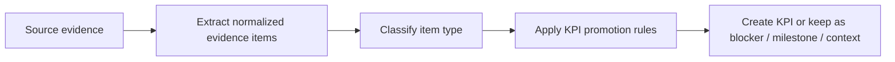

# KPI Extraction Framework

This folder contains the canonical KPI extraction framework for ClearPulse.

It replaces the earlier spreadsheet-style logic with a cleaner, more scalable structure that works across all sources while still allowing us to start with a Fathom-first implementation.

## Why this exists

The original KPI rules mixed together several different questions:

1. What should be extracted from source evidence?
2. What is a KPI versus a blocker, milestone, or context signal?
3. Which sources are strong enough to support committed KPIs versus working KPIs?
4. How should ambiguous cases be reviewed?

Those questions should not live in one flat sheet.

This framework separates them into four layers:

1. `01-evidence-item-schema.csv`
Defines the normalized item shape that any source can produce after extraction.

2. `02-kpi-policy-matrix.csv`
Defines the rule logic for deciding whether an extracted item should become a KPI.

3. `03-source-coverage-matrix.csv`
Defines what each source is good at and where it should be trusted or used cautiously.

4. `04-example-evaluation-set.csv`
Provides concrete examples that can be used for stakeholder review, prompt refinement, and evaluation.

5. `05-fathom-first-profile.csv`
Defines the initial operating profile for Fathom so we can start there without hard-coding the whole system around a single source.

## Core idea

The scalable model is:

That means the system should not ask:

"Turn everything important into a KPI."

Instead it should ask:

1. What relevant items exist in this evidence?
2. Which type is each item?
3. Which of those item types should actually become KPI rows?

## Recommended universal item classes

These are the normalized item classes the product should support across all sources:

- `KPI_CANDIDATE`
- `CUSTOMER_GOAL`
- `BLOCKER`
- `ACTION_ITEM`
- `DECISION`
- `MILESTONE`
- `RISK_SIGNAL`
- `FEATURE_REQUEST`
- `GENERAL_CONTEXT`
- `HEALTH_SIGNAL`
- `INTERNAL_ONLY`

## Recommended KPI output classes

These are the KPI-level output classes the policy should support:

- `COMMITTED_KPI`
- `CONFIRMED_WORKING_KPI`
- `WORKING_KPI`
- `SUGGESTED_KPI`
- `BLOCKER`
- `MILESTONE`
- `HEALTH_SIGNAL`
- `CONTEXT_ONLY`
- `INTERNAL_ONLY`

## Fathom-first, not Fathom-only

The initial implementation should focus on Fathom because it provides:

- meeting summaries
- transcript evidence
- recurring customer goals
- blockers and rollout conditions
- rich business context

But the policy should still stay source-agnostic.

That is why:

- the schema is universal
- the KPI rules are universal
- the source matrix explains where trust should differ by source
- the Fathom profile is only a first operating profile, not the total framework

## How to use these files

### For stakeholder alignment

Use:

- `02-kpi-policy-matrix.csv`
- `04-example-evaluation-set.csv`

These are the easiest files for a manager or team lead to review.

### For prompt design

Use:

- `01-evidence-item-schema.csv`
- `02-kpi-policy-matrix.csv`
- `05-fathom-first-profile.csv`

These define what the model should extract and when items should be promoted into KPIs.

### For future source expansion

Use:

- `03-source-coverage-matrix.csv`

This helps decide how Slack, Vitally, Salesforce, Jira, docs, and other sources should feed the same KPI framework.

## Important design principle

Do not force everything into a KPI row.

A strong system distinguishes between:

- a KPI
- a blocker
- a milestone
- context
- a health signal
- an internal task

That distinction is what makes KPI extraction trustworthy and scalable.
