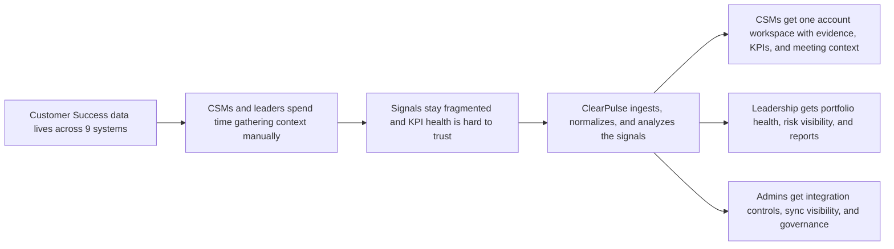
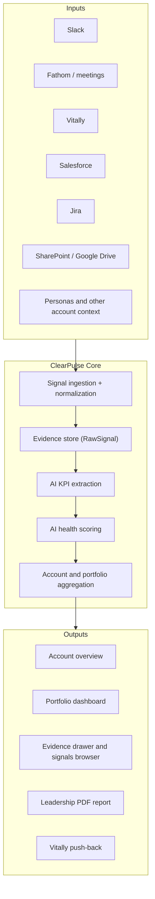
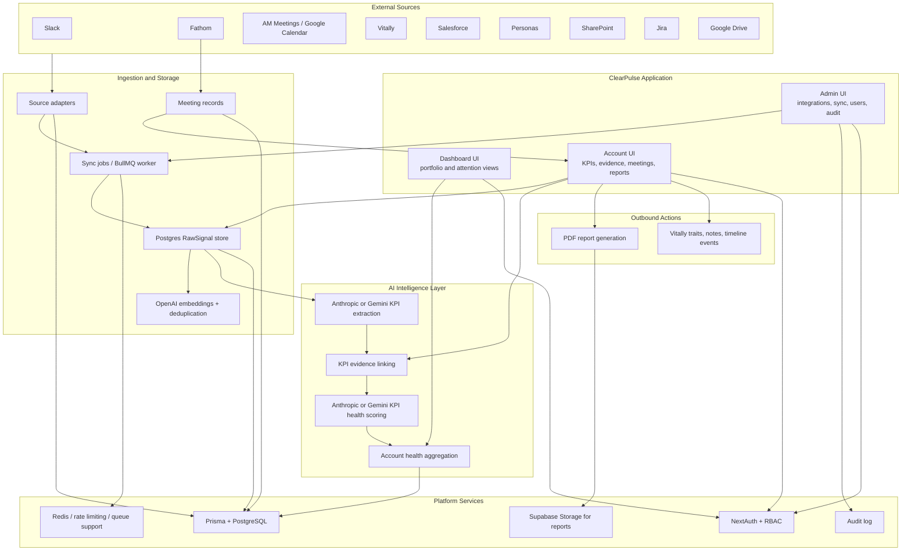

# ClearPulse Product Architecture and AI Flow

Use this guide when you need to explain:

- the business problem ClearPulse solves
- how the product works end to end
- how raw customer data becomes KPIs and health signals
- what happens behind the scenes in the platform

## 1. The Problem We Solve

Customer Success teams usually operate across too many disconnected systems:

- Slack threads
- meeting transcripts
- CRM notes
- Jira issues
- docs and shared folders
- customer success platforms like Vitally

That creates three recurring problems:

1. teams manually stitch together the customer story before QBRs, renewals, and risk reviews
2. KPI health is often inferred from scattered context instead of traceable evidence
3. leadership sees lagging updates instead of a real-time portfolio view

ClearPulse solves this by turning fragmented customer signals into one evidence-backed operating layer for accounts, KPIs, health scoring, and reporting.

## 2. Business Diagram

## 3. Product Story In One Diagram

## 4. System Diagram

## 5. How Data Becomes KPIs

```mermaid
flowchart LR
  A["Source data fetched"] --> B["Normalized into RawSignal"]
  B --> C["Embedded and checked for duplicates"]
  C --> D["Stored as account-linked evidence"]
  D --> E["Claude extracts KPI candidates"]
  E --> F["KPI records created or updated"]
  F --> G["Evidence linked back to source signals"]
  G --> H["Claude scores KPI health and writes narrative"]
  H --> I["Account health score is aggregated"]
  I --> J["Dashboard, account pages, reports, and Vitally update"]
```

## 6. What Happens Behind The Scenes

### Step 1: Ingestion

Each source adapter fetches account-relevant data and converts it into a shared `RawSignal` shape.

That means the system does not score health directly from raw Slack text, meeting dumps, or CRM blobs. Everything first becomes normalized evidence.

### Step 2: Deduplication

New signals are embedded and compared with existing signals for the same account.

If a signal is effectively the same as something already stored, it is skipped. This keeps the evidence layer cleaner and reduces noisy KPI extraction.

### Step 3: KPI Extraction

Anthropic or Gemini receives batches of normalized signals and returns structured KPI candidates, including:

- metric name
- target value
- current value
- category
- evidence references
- optional meeting timestamp

The app validates the response, merges duplicates, stores `ClientKPI` records, and links `KPIEvidence` rows back to the source signals.

### Step 4: Health Scoring

For each KPI, the system sends:

- the KPI definition
- linked evidence signals
- recent account context
- priority notes and key contact signals

The selected text-generation provider returns:

- health score
- health status
- trend
- narrative explanation
- key evidence IDs

The result is stored on the KPI and then rolled up into an account-level health score.

### Step 5: Product Surfaces

Once KPIs and health exist, ClearPulse can power:

- the portfolio dashboard
- account overview pages
- raw evidence views
- meeting history
- PDF reports
- Vitally push-back

## 7. Why The AI Is Useful Here

The AI is not acting like a generic chatbot. It is embedded into a workflow:

- ingestion creates a clean evidence layer
- extraction turns evidence into structured KPIs
- scoring turns KPIs plus context into a health decision
- humans can review, edit, and trace the evidence

That is what makes the AI practical for internal operating workflows instead of just exploratory.

## 8. Human Review and Control

ClearPulse is designed as a controlled AI system, not a black box.

Key trust layers:

- structured JSON output from AI calls
- validation before writing to the UI
- evidence linked back to source signals
- role-based permissions
- audit logging
- manual editing for KPIs and account fields

## 9. Demo Narrative

If you are showcasing the product live, this is the simplest narrative:

1. Teams already have customer context, but it is scattered across 9 systems.
2. ClearPulse ingests those signals and normalizes them into one evidence layer.
3. AI extracts KPIs and connects each KPI to the supporting signals.
4. AI scores KPI health and explains the result with traceable evidence.
5. The same intelligence powers account reviews, portfolio dashboards, reports, and downstream updates.

## 10. One-Line Positioning

ClearPulse is an AI-powered customer intelligence layer that transforms fragmented post-sale data into evidence-backed KPIs, account health, and leadership reporting.
